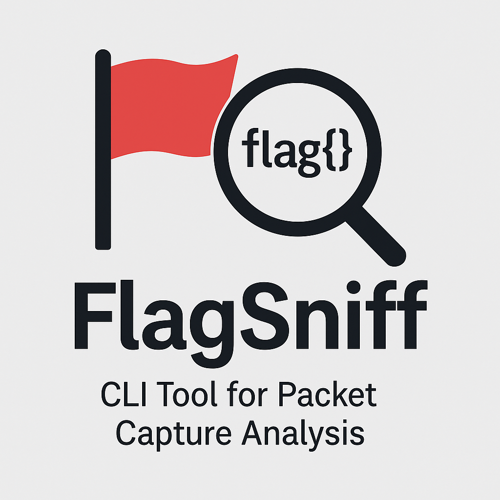

# 🏴‍☠️ FlagSniff

**FlagSniff** is a command-line tool designed for red teamers, penetration testers, and cybersecurity learners. It parses `.pcap` / `.pcapng` network capture files and extracts sensitive data such as flags, emails, JWT tokens, and other secrets using customizable regex patterns.



---

## 🔍 Features

- 📡 Extracts flags from `.pcap` files (e.g., `flag{...}`)
- 📧 Detects common secrets like JWT tokens and email addresses
- 🎯 Supports custom regex patterns
- 📁 Saves extracted matches in a `results.json` file
- 🎨 Beautiful CLI output using [Rich](https://github.com/Textualize/rich)
- 🧩 Modular code with extendable parsers

---

## 🧠 Supported Patterns

By default, the tool detects:

    ✅ flag{...} – Capture the Flag flags

    ✅ JWT tokens – Base64-encoded tokens

    ✅ Emails – Common email formats

Want more? Just pass your own regex with --regex.

## 📦 Installation

### 1. Clone the repo

```bash
git clone https://github.com/your-username/FlagSniff.git
cd FlagSniff

2. Set up virtual environment (optional but recommended)

python -m venv .venv
source .venv/bin/activate  # On Windows: .venv\Scripts\activate

3. Install dependencies

pip install -r requirements.txt

🚀 Usage
Basic usage

python flagsniff.py -f path/to/file.pcapng

Custom regex search

python flagsniff.py -f path/to/file.pcapng --regex "password=.*"

🧪 Sample Output

Packet #3: flag{yourflag}
Packet #7: eyJhbGciOiJIUzI1NiIsInR5cCI6IkpXVCJ9...
Packet #9: johndoe@example.com


📂 Output File

Results are saved in a JSON file:

[
  {
    "packet": 3,
    "match": "flag{your flag}"
  },
  {
    "packet": 7,
    "match": "eyJhbGciOiJIUzI1NiIs..."
  }
]


👨‍💻 Author

Manoj Kumar 
💼 cybergodfather.me
🐙 @github.com/Manoj-Root
📜 License

This project is licensed under the MIT License.

    ⚠️ For educational purposes only. Do not use on networks you do not own or have permission to test.
